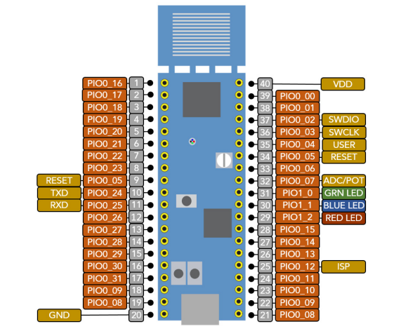

# KITLPC845
 Librerias propias comenzadas a realizar en Informatica II y continuadas de forma particular.
 Cubren la mayoria de los perifericos del Kit de desarrollo LPC845.
 No poseen implementaciones de DMA.

# Informacion:

EN CASO DE QUERER UTILIZAR ESTA PLAQUETA:
- Nombre de la plaqueta: LPC845.
- Alimentación de 3,3V. (Para alimentar externamente GND en pin 20 y 3,3v en pin 40).
- Programada con "MCUexpresso".
- Lenguaje C++.
## Drivers/Periféricos ya creados:
- Input.
- Output.
- Timer.
- Reloj.
- ADC.
- DAC.
- PWM.
- Lector de ancho de pulso (PWM_Reader).
- UART (comunicación serie).
- Display de 7 segmentos.
- Display LCD.
- Teclado matricial.
- Puente H para motores.
- Ultrasónico.
- ESP01 (Wifi arduino con comandos AT).  
- I2C.
- SPI.

## Para crear un proyecto nuevo:
- File.
- New.
- New C/C++ Proyect.
- (Se selecciona la plaqueta a utilizar)  Next >.
- C++ Proyect.
- (Se escribe el nombre del proyecto).
- Se toca "Next >" hasta terminar.

## Para utilizar este proyecto:
- Import proyect(s) from file system.
- (Se selecciona el archivo .zip o esta carpeta) Next > .
- Finish.
- Se puede renombrar al proyecto con cualquier nombre. (Los includes se autoconfiguran para seguir funcionando).
(Con la placa conectada)
- El "bicho azul" carga el programa la primera vez.
- El "bicho verde" carga el programa las veces siguientes.

En caso de requerir los nombres de cada pata y su función, buscar hoja de datos en internet.